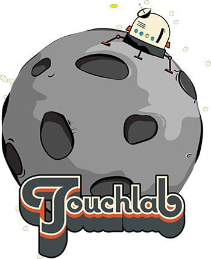

 
 
 

# KaMP Kit

***Welcome to the KaMP Kit!*** 

## About

### Goal

The goal of the KaMP Kit is to facilitate your evaluation of Kotlin Multiplatform (aka KMP). It is a collection of code and tools designed to get you started quickly.

The KMP ecosystem has generated a lot of excitement, and has evolved very rapidly. As a result, there's a lot of old or conflicting documentation, blog posts, tutorials, etc. We, Touchlab, have worked with several teams looking at KMM and KMP, and have found that the **primary** stumbling block is simply getting started.

The KaMP Kit is designed to get you past that primary stumbling block. You should be able to set up your development environment, clone the repo, and have a running sample app very quickly. From there, you can focus on what you want to build.

#### *Very Important Message!!!*

This kit exists because the info you may find from Google about KMM and KMP is likely to be outdated or conflicting with the config here. It is highly recommended that you reach out directly if you run into issues.

### Audience

We (Touchlab) are focused primarily on using KMP for native mobile development (now called KMM). As a result, this kit is primarily targeted at native mobile developers (Android or iOS), as well as engineering managers for native mobile teams. You should have little-to-no experience with KMP, although some of the information after setup may be useful if you do have KMP experience.

## What's Included?

1. The Starter App - A native mobile KMP app with a small functional feature set.
2. Educational Resources - Introductory information on KMP and Kotlin/Native.
3. Integration Information - If you're integrating shared code into an existing application, guides to assist with that effort.

## What's *Not* Included?

Comprehensive guides, advanced tutorials, or generally support for fixing anything not included in the starter app. The goal is to have a solid starting point from which you can create something meaningful for evaluating KMP. We're intentionally limiting the scope to keep focus.

## Getting Help

KaMP Kit support can be found in the Kotlin Community slack. Look for the `kampkit-support` channel.

To join the Kotlin Community slack, [request access here](http://slack.kotlinlang.org/)

For direct assistance, please [reach out to Touchlab](https://go.touchlab.co/contactkamp) to discuss support options.

# The Starter App

The central part of the "Kit" is the starter app. It includes a set of libraries that we use in our apps that provide for much of the architectural needs of a native mobile application. We've also included a simple set of features you can use as a reference when adding your features.

## 1) Dev Environment and Build Setup

You will need the following:

* JVM 8
* Android SDK and the latest stable Android Studio(4.1.3) or IntelliJ(2021.1+)
* Intellij Kotlin plugin with 1.4.3x support (should be included in the latest Android Studio or IDEA)
* Mac with Xcode 12+ for the iOS build

For a more detailed guide targetted at iOS developers, see [DETAILED_DEV_SETUP](docs/DETAILED_DEV_SETUP.md).

## 2) Clone and Build

See [APP_BUILD](docs/APP_BUILD.md) for detailed build instructions. By the end of that doc you should be able to build and run both Android and iOS apps.

---

## Sanity Check

At this point, you should be able to build Android and iOS apps. **If you cannot build, you need to get help.** This sample app is configured to run out of the box, so if it's not working, you have something wrong with your build setup or config. Please [reach out to us](CONTACT_US.md) so we can improve either the config or troubleshooting docs, and/or the Kotlin Slack group mentioned above.

---

## 3) Walk Through App

Take a walk through the app's code and libraries. Make changes, recompile. See how it works.

[GENERAL_ARCHITECTURE](docs/GENERAL_ARCHITECTURE.md)

## 4) Background Education

If the app is building, it's a good time to take a break and get some background information.

### KMP Intro

It's important to understand not just how to set up the platform, but to get a better perspective on what the tech can do and why we think it'll be very successful. KMP is distinct from other code sharing and "cross platform" systems, and understanding those distinctions is useful.

[Longer intro to KaMP Kit](docs/WHAT_AND_WHY.md) - Original version of this doc's intro. Cut because it was pretty long.

[Intro to Kotlin Multiplatform](https://vimeo.com/371428809) - General intro to KMP from Oredev in Nov 2019. Good overall summary of the platform.

### Kotlin/Native Concurrency

Kotlin/Native's state and concurrency model is different than the JVM (which includes Android). The goal is "[Saner Concurrency](https://medium.com/@kpgalligan/saner-concurrency-74b0bf8ed446)" In practice, if you're not writing custom concurrency logic, it's pretty simple, *but only if you understand it*. You ***must*** learn the basics.

[Practical Kotlin Native Concurrency](https://dev.to/touchlab/practical-kotlin-native-concurrency-ac7) - Our recent blog post series. This was written for KaMP KIt, but we published these separately because this is very important for developers to understand.

[Kotlinconf 2019: Kotlin Native Concurrency Explained](https://www.youtube.com/watch?v=oxQ6e1VeH4M) - Deeper dive talk from Kotlinconf.

**We cannot stress this enough. If you're going to build anything significant, you need at least a basic understanding of the concurrency model.**

We should also point out, the version of coroutines we're using in native is still a preview release. We discuss that in the docs linked above, and more detail in [GENERAL_ARCHITECTURE](docs/GENERAL_ARCHITECTURE.md#Kotlinx-Coroutines).

### "Selling" KMP

KaMPKit can help you demonstrate to management and other stakeholders of the value of sharing code with KMP. Check out these resources for more advice on pitching KMP to your team:
[Building a Business Case for KMP](https://touchlab.co/building-business-case-kotlin-multiplatform/)
[7 ways to convince your engineering manager to pilot Kotlin Multiplatform](https://touchlab.co/7-ways-convince-engineering-manager-pilot-kotlin-multiplatform/)

### Xcode Debugging

For information on how to debug kotlin in Xcode, check out the [Debugging Kotlin In Xcode](docs/DEBUGGING_KOTLIN_IN_XCODE.md) doc. 

## 5) Integrating 'shared' With Existing Apps

As part of your evaluation, you'll need to decide if you're going to integrate KMP into existing apps. Some teams feel integrating with their production apps is a better demonstration of KMP's viability. While KMP's interop is great, relative to other technologies, **integrating *anything* into a production app build process can be a difficult task**. Once integrated, development is generally smooth, but modifying production build systems can be a time consuming task.

### Android

The Android side is somewhat more straightforward. Kotlin is the preffered language for Android, and the library can be integrated as just another module library. We'll be updating soon with a general Android integration doc. In the meantime, the simplest method would be to copy the shared module into your standard Android build, and use the `app` module as a reference for dependency resolution.

### iOS

The iOS integration process is relatively new and has been iterating fast. Be prepared to spend more time with config related issues when integrating with a production build.

You can integrate with Cocoapods, or by directly including the Xcode framework. If you are an Android developer without extensive iOS build experience, be aware that this is a risky option. Production build systems, for any ecosystem, tend to be complex. You'll almost certainly need to recruit somebody with experience maintaining your iOS build.

See [IOS_PROJ_INTEGRATION.md](docs/IOS_PROJ_INTEGRATION.md) for iOS integration information.

If you are attempting to integrate your KMP project with a production iOS application, please let us know what issues you run into and reach out with questions if stuck. This is an ongoing area of improvement for the KMP platform and we'd like to help make this as smooth as possible.

---

## Troubleshooting

[TROUBLESHOOTING](docs/TROUBLESHOOTING.md) - We'll be growing this file over time, with your help. Please make sure
to document any issues you run into and [let us know](CONTACT_US.md). 

## More To Come!

KaMP Kit is just the beginning. Our hope is that after KaMP Kit you’ll have a better sense of what a possible KMP implementation might look like.

## Primary Maintainer

[Brady Aiello](https://github.com/brady-aiello/)

*Ping me on twitter [@AielloBrady](https://twitter.com/@AielloBrady/) if you don't get a timely reply!* -Brady

---

### About Touchlab

Touchlab is a mobile-focused development agency based in NYC. We have been working on Android since the beginning, and have worked on a wide range of mobile and hardware projects for the past decade. Over the past few years, we have invested significantly on R&D for code sharing technologies. We believe strongly in KMP's future and are making the Kotlin platform the focus of our business.

### About The Kit

We talked to a few teams early on who got to do a "hack week" with KMP. A common story was, if they didn't abandon the project altogether, they didn't have anything running till the week was half over. Even then, picking libraries and architecture ate the rest of the time. Inevitably the result was, "KMP isn't ready". We know that once you're past the setup phase, KMP is really amazing tech. This Kit exists so you're evaluating KMP on Monday afternoon, not Thursday.

### What We Can Do For You

We have made KMP the focus of Touchlab. We had possibly the first KMP* app published in the iOS App Store, and have extensive experience in building libraries and the Kotlin platform, including contributions to Kotlin/Native itself. We can establish and accelerate your adoption of shared Kotlin code. See [touchlab.co](https://touchlab.co) for more info.

### We're Hiring!

Touchlab is looking for a Mobile Developer, with Android/Kotlin experience, who is eager to dive into Kotlin Multiplatform Mobile (KMM) development. Come join the remote-first team putting KMM in production. [More info here](https://go.touchlab.co/careers-gh).

