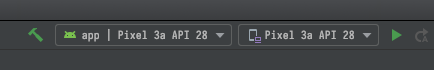
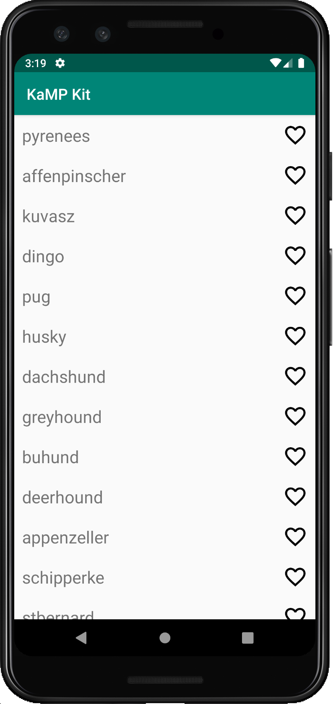
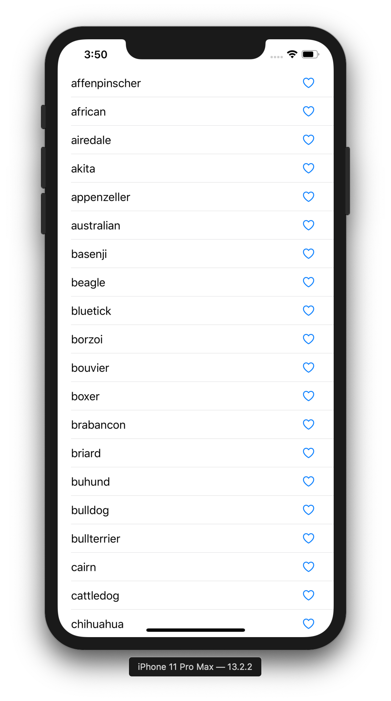

# Sample App Build

## Prerequisites
Before you build the app you will require these items:

* JVM 8
* Android SDK and Android Studio or IntelliJ
* Mac with Xcode 11+ for the iOS build

For more details, check out the [DETAILED_DEV_SETUP](DETAILED_DEV_SETUP.md) document.

### 1) Clone the app
Run the following on the command line
```
git clone https://github.com/touchlab/KaMPKit.git
```

### 2) Build Android
1. Open the project in Android Studio/IntelliJ and wait for indexing to finish.
1. Make sure you see the run config for the Android app                    

1. Run the Android app on either the Emulator or a phone. If the app builds correctly, you should see this:



### 3) Build iOS

1. [Optional] Run gradle build. If you are more familiar with Android it may be easier to run the gradle build and confirm that the shared library builds properly before moving into XCode land, but this isn't necessary. The shared library will also build when run in XCode.
   1. Open a Terminal window or use the one at the bottom Android Studio/IntelliJ. 
   1. Navigate to the project's root directory (`KaMPKit/` - not `KaMPKit/ios/` - which is iOS project's root directory). 
   1. Run the command `./gradlew build` which will build the shared library.
1. Open Xcode **workspace** project in the `ios/` folder: `KaMPKitiOS.xcworkspace`.
1. Run the iOS app on either the Simulator or a phone. If the app builds correctly, you should see this:



## Did that work?

Congratulations! You have a functional sample app to start working from. Head back to the [README.md](../README.md#Sanity-Check) for next steps.

### Common Issues

See [TROUBLESHOOTING](TROUBLESHOOTING.md)

### Contact

If you're having issues, you can view the [contact Document here](https://github.com/touchlab/KaMPKit/blob/master/CONTACT_US.md) for contact information.
