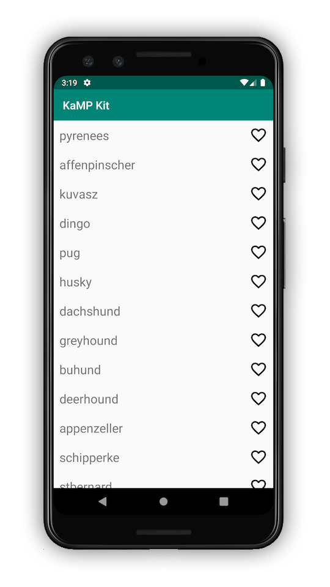
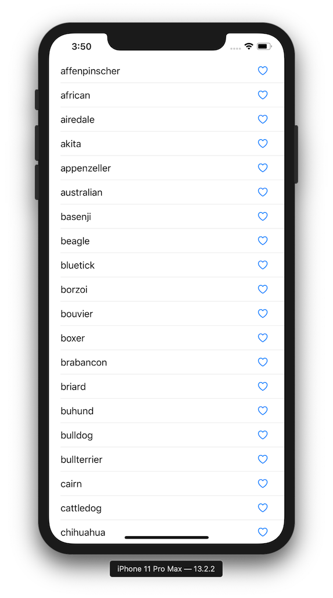

# Sample App Build

## Prerequisits
Before you build the app you will require these items:

* JVM 8
* Android SDK and Studio/IntelliJ
* Xcode 11+ for the iOS build

For more details, check out the [IOS_DEV_SETUP](IOS_DEV_SETUP.md) document.

### 1) Clone the app
Run the following on the command line
```
git clone https://github.com/touchlab/KaMPStarter.git
```

### 2) Build Android
1. Open the project in Android Studio/IntelliJ and wait for indexing to finish.
1. Make sure you see the run config for the Android app

1. Run the Android app on either the Emulator or a phone. If the app builds correctly, you should see this:



### 3) Build iOS

1. Open a Terminal window or use the one at the bottom Android Studio/IntelliJ. Navigate to the project's root
 directory (`KaMPStarter/` - not `KaMPStarter/ios/` - which is iOS project's root directory). Run the command
  `./gradlew build` which will build the shared library.
1. Open Xcode **workspace** project in the `ios/` folder: `KaMPStarteriOS.xcworkspace`.
1. Run the iOS app on either the Simulator or a phone. If the app builds correctly, you should see this:



## Did that work?

Congratulations! You have a functional sample app to start working from. Head back to the [README.md](README.md) for next steps.

### Common Issues

**Q:** When I tried to build the library, why did I get the following error? "SDK location not found
. Define location with an ANDROID_SDK_ROOT environment variable or by setting up the sdk.dir path in your project's
 local properties file... "

**A:** This error occurs when the project does not know the location of your local Android SDK. It should be located
 at `/Users/[YOUR_USER_NAME]/Library/Android/sdk`, which is where Android Studio recommends you put it during initial
  setup/installation.

  Opening this project in Android Studio will automatically create and configure a `local.properties` file for you
  . If you want to do that yourself, create a file called `local.properties` in the root directory of this project
  . Paste in the following line, replacing [YOUR_USER_NAME] with, you guessed it, the username you're using on your
   local machine:

```
sdk.dir=/Users/[YOUR_USER_NAME]/Library/Android/sdk
```

>**Note**: The `local.properties` file should not be committed to version control, as the path will be different for
> anyone else working on the project.


**Q:** When I tried to run the project in Xcode, why did I get the following error? "Framework not found
 shared_umbrella".

**A:** You probably opened the `.xcodeproj` file instead of the `.xcworkspace`. Close out the `.xcodeproj` and open
 the `.xcworkspace` and run again.

 To learn more about Cocoapods and how to use them, check out [their official guide](https://guides.cocoapods.org/using/index.html).


**Q:** The Xcode project won't compile. On the `import shared` line in Swift, I'm getting a compilation error "no
 such module: 'shared'".

**A:** Try closing Xcode and deleting the `Pods/` folder located in the root directory of the iOS project. Then run
 the command `pod install` in that same iOS root directory (which is `/KaMPStarter/ios/` to be specific). This
  command will generate a new `Pods` folder. Reopen the `.xcworkspace` file and try to build again.

> Note: We're still not quite sure as to the cause of this error. Possible factors include differing versions of
> Cocoapods or Xcode.

### Contact

If you're having issues, you can view the [contact Document here](https://github.com/touchlab/KaMPStarter/blob/master/CONTACT_US.md) for contact information.
