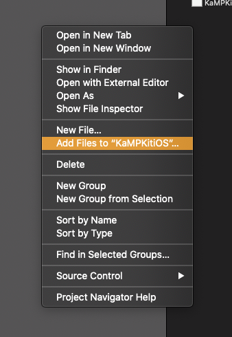
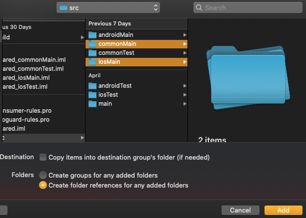

# Debugging Kotlin in Xcode

By this point you should be able to build and run KaMP Kit in iOS using Xcode. Great! Maybe you've
changed a variable and want to see if it actually updated successfully, but how do you do that? Well
we at Touchlab have actually created a way to **debug kotlin code in Xcode**.

### Kotlin Native Xcode Plugin

The [Kotlin Native Xcode Plugin](https://github.com/touchlab/xcode-kotlin) adds basic highlighting,
allows you to set breakpoints and includes llvm support to view data in the debug window. You can
find the steps to install this plugin on its readMe. Newly a CLI (command line interface) was added -
it is an executable that is installed on your machine and manages the plugin installation(s). It allows:

- Homebrew installation
- Better Xcode integration (No more "Load Bundle" popups!)
- Easier management of multiple Xcode installations
- Automatic "sync". When Xcode updates, we need to update the plugin config. This previously
  required updating the xcode-kotlin project GitHub repo, pulling, and reinstalling. The CLI can do
  this locally.
- Better diagnostic info and support for install issues.

### Kotlin Source in Xcode

To take advantage of the plugin you will want to add references to your kotlin code in Xcode. This
will allow you to add breakpoints and edit kotlin without switching to Android Studio. You probably
won't want to do your primary kotlin coding like this, but it's helpful when debugging.

To add the Kotlin source:
1. Right click in the project explorer

2. In the finder opened, select the kotlin source you want included (commonMain and iosMain). Be sure to select "Create folder references for any added folders"

